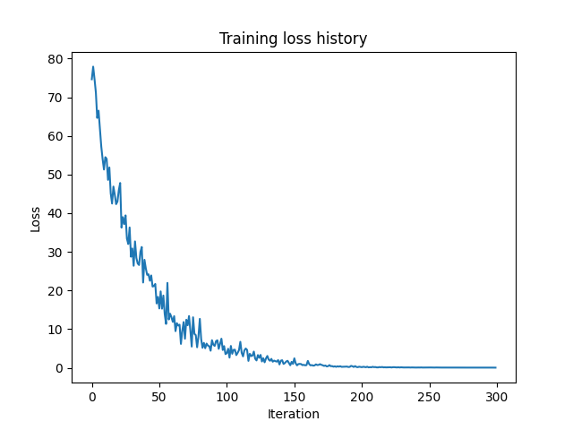
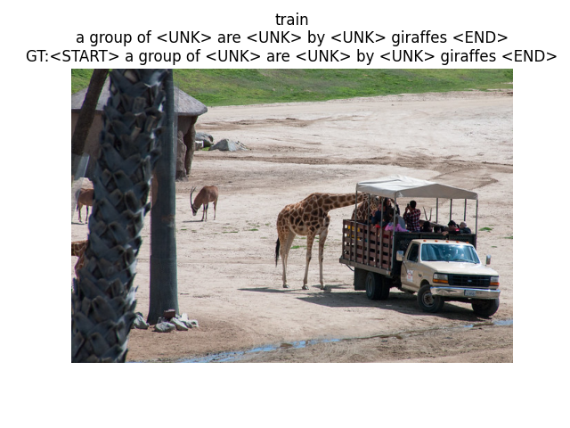
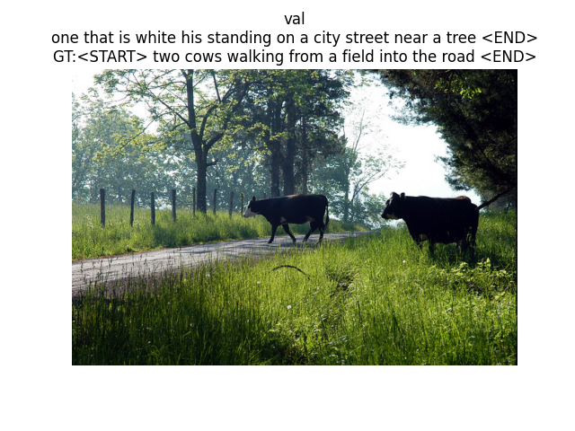

# image-captioning-bottom-up

## 1. Introduction
+ Image Captioning is the task of describing the content of an image in words. This task lies at the intersection of computer vision and natural language processing. Most image captioning systems use an encoder-decoder framework, where an input image is encoded into an intermediate representation of the information in the image, and then decoded into a descriptive text sequence.
+ In this project, i implemented Image Captioning through 3 architectures: RNN (Recurrent Neural Network), LSTM (Long Short-Term Memory), and Transformer from scratch.

## 2. Concepts
+ __Encoder-Decoder architecture__. Typically, a model that generates sequences will use an Encoder to encode the input into a fixed form and a Decoder to decode it, word by word, into a sequence.
+ In terms of the encoder, I use a pretrained VGG16 to extract features from the input images into a vector of dimension 4096. After that, I reduce the dimensionality to 512 using PCA (Principal Component Analysis). Please take a look at the [features_extraction.py](features_extraction.py) for a clearer understanding of the feature extraction process. To apply the PCA technique and reduce the dimensionality to 512, the minimum batch size of your images should be 512. As the goal of this project is focused on building a decoder, I utilize preprocessed features from the COCO dataset. 
+ For the decoder, I build RNN, LSTM, and Transformer from scratch. Why do I do this? Because I want to have a detailed understanding of and insights into the architectures that have been and are making waves in AI in general and NLP in particular.
## 3. Setup

### Enviroment
I'm using PyTorch 2.0.1 and Python 3.8.16.


### Datasets
For this project, i will use the 2014 release of the [COCO dataset](https://cocodataset.org/), a standard testbed for image captioning. The dataset consists of 80,000 training images and 40,000 validation images, each annotated with 5 captions written by workers on Amazon Mechanical Turk. To get data:

```bash
cd core/datasets
bash get_datasets.sh
```
And below is my folder hierarchy:
```
.
├── core
│   ├── captioning_solver.py
│   ├── captioning_solver_transformer.py
│   ├── coco_utils.py
│   ├── datasets
│   │   ├── coco_captioning
│   │   ├── get_coco_captioning.sh
│   │   ├── get_datasets.sh
│   │   ├── get_imagenet_val.sh
│   │   └── imagenet_val_25.npz
│   ├── image_utils.py
│   ├── model
│   │   ├── rnn_model.py
│   │   └── transformer.py
│   ├── optim.py
│   ├── rnn_layers.py
│   └── transformer_layers.py
├── inference.py
├── lstm_checkpoint.npz
├── lstm_utils.py
├── README.md
├── rnn_checkpoint.npz
├── rnn_utils.py
├── training.py
└── transformer_model.pt
```
## 4. Usage
### Training
```python
python training.py --model "transformer" --num_samples 10000 
```
### Inference
```python
python inference.py --model "transformer" --num_samples 10000
```

## 5. Overfit RNN/LSTM/Transformer Captioning Model on Small Data
+ Training 

  ```python
  python training.py --model "rnn" --num_samples 300
  ```
+ Loss: yayyy, it works 😄 

     

+ Inference: 
  ```python
  python inference.py --model "rnn"
  ```
+ Result: 
  
    
    
## 6. Conclusion
For the project's goal of building a decoder from scratch, in order to assess its feasibility, I only trained on a small dataset to see if it performs well, and yay, it worked fine. If you want to increase the overall capacity of the model, you can increase the num_samples parameter (in this project, the maximum value is 400,145).
